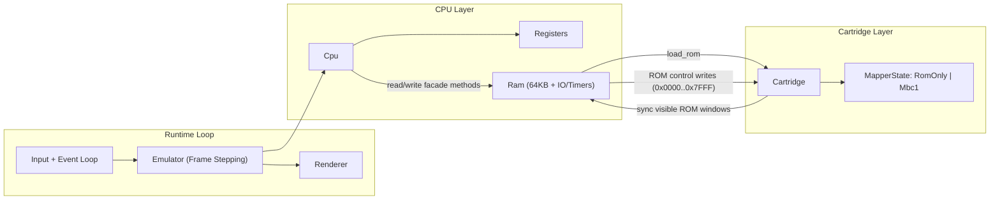

# Gabalah

An emulator for the Nintendo Game Boy.

## Prerequisites

In order to build and run Gabalah, all you need is 
a working Rust toolchain, specifically `cargo` and `rustc`.

Refer to [the official site of the Rust programming language](https://www.rust-lang.org) 
to learn more.

## Build and run

Gabalah expects a path to a ROM input as its single command line argument.
Supported inputs:

- raw ROM files (`.gb`, `.gbc`, or any raw bytes)
- ZIP archives (`.zip`)
- GZIP-compressed ROMs (`.gz`)
- 7-Zip archives (`.7z`)

``` sh
$ cargo run path/to/some_rom.gb
```

### Cargo Feature Flags

Gabalah now supports a minimal core build with optional frontend and archive format support.

Enabled by default:

- `frontend`
- `frontend-pixels`
- `frontend-wgpu`
- `rom-zip`
- `rom-gzip`
- `rom-7z`

Common build profiles:

```sh
# Full app (default features)
cargo run -- path/to/rom.gb

# Core emulator library only (no windowing/backends/archive decoders)
cargo build --no-default-features

# Minimal frontend with terminal backend and raw ROM loading only
cargo run --no-default-features --features frontend -- path/to/rom.gb
```

For ZIP/7Z archives with multiple ROM candidates, use `--entry` to pick an exact archive path:

``` sh
$ cargo run -- --entry "testroms/mooneye/acceptance/ei_sequence.gb" rom_bundle.zip
```

### Cartridge Metadata

On ROM load, Gabalah parses the Game Boy cartridge header (`0x0100..0x014F`) and stores metadata
for later use (title, licensee, CGB/SGB flags, cartridge type, ROM/RAM bank counts, destination,
version, and both checksum fields).

Current access points:

- `Cpu::cartridge_header() -> Option<&CartridgeHeader>`
- `Ram::cartridge_header() -> Option<&CartridgeHeader>`

This currently parses and exposes checksum fields; checksum enforcement/validation is not yet
wired into ROM load rejection logic.

### Architecture Overview

Current emulator boundaries:

- `Cpu` owns instruction execution state and exposes a focused memory facade.
- `Ram` owns the 64KB memory cells plus IO/timer behavior.
- `Cartridge` owns ROM bytes, parsed header metadata, and mapper runtime state.
- Mapper writes (`0x0000..0x7FFF`) update cartridge state; RAM keeps visible ROM windows in sync for fast reads.



### Graphics Backend Configuration

Gabalah reads optional graphics settings from `config.json` in the project root.

```json
{
  "graphics_backend": "wgpu_shader",
  "window": {
    "scale": 3.0
  },
  "controls": {
    "joypad": {
      "up": "up",
      "down": "down",
      "left": "left",
      "right": "right",
      "a": "z",
      "b": "x",
      "select": "right_shift",
      "start": "enter"
    },
    "hotkeys": {
      "reload_graphics_config": "r",
      "previous_shader": "q",
      "next_shader": "e",
      "debug_frame_dump": "f9",
      "exit": "escape"
    }
  },
  "debug_dump": {
    "enabled": true,
    "output_directory": "debug_dumps"
  },
  "shader": {
    "directory": "shaders",
    "scanline_strength": 0.22,
    "curvature": 0.10,
    "mode": "palette_mutation",
    "color_intensity": 0.82,
    "active_file": "crt.wgsl"
  }
}
```

Supported values for `"graphics_backend"`:

- `"pixels"`: existing `pixels` presentation path
- `"terminal"`: ANSI truecolor rendering in the terminal (novelty backend)
- `"wgpu_shader"`: WGSL runtime shader-library backend

`"window.scale"` controls the initial window size multiplier. It must be a finite number greater
than `0`. If omitted, Gabalah uses `3.0`.

Supported values for `"shader.mode"`:

- `"classic"`
- `"prism"`
- `"aurora"`
- `"palette_mutation"`

`"shader.mode"` and `"shader.color_intensity"` are passed as uniforms to the active shader.
How they are interpreted depends on that shader file.

Runtime WGSL shaders are loaded from `"shader.directory"` and default to `./shaders` in the
project root. Every file must provide
`vs_main`/`fs_main` and the expected texture/sampler/uniform bindings.
`"shader.active_file"` selects the preferred shader filename and is updated when cycling shaders.

`"controls"` is optional. If omitted, Gabalah keeps the current defaults shown above. Supported key
names include letters, digits, arrows, `enter`, `escape`, `tab`, `space`, `left_shift`,
`right_shift`, `left_ctrl`, `right_ctrl`, `left_alt`, `right_alt`, and `f1` through `f12`.

`"debug_dump.enabled"` controls whether the dump hotkey can queue a capture.
`"debug_dump.output_directory"` controls where frame dumps are written.

Bundled runtime shaders:

- `crimson_cluster.wgsl`: concentrates red in zones with high local dark-pixel density
- `crt.wgsl`: dedicated CRT pass (curvature + scanlines + phosphor/flicker)
- `comic_halftone_pop.wgsl`: halftone dots + animated ink-outline comic treatment
- `funk_spectrum.wgsl`: aggressive non-CRT color remap
- `heart_pixels.wgsl`: renders each source pixel as a tiny heart shape
- `jelly_tiles.wgsl`: rounded gel-like pixel tiles with subtle wobble and specular shine
- `no_effect.wgsl`: passthrough (use this to effectively disable shader effects)
- `wiggle_ripple.wgsl`: per-pixel ripple displacement with a soft, pleasing wobble

Press `R` while running to reload shader settings, debug dump settings, and rescan the configured
shader directory without restarting.
Changing `"graphics_backend"` still requires restarting the app.

The terminal backend renders into an alternate terminal screen at a fixed 80x24 grid and
intentionally caps redraw rate for readability.

### Enable Terminal Backend

Set `graphics_backend` in `config.json`:

```json
{
  "graphics_backend": "terminal"
}
```

Then run as usual:

```sh
cargo run -- path/to/your_rom.gb
```

Backend aliases `"tty"` and `"ansi"` are also accepted.
Use `Escape` to exit and restore the normal terminal screen/cursor state.

### Controls

- D-Pad: configurable, defaults to Arrow keys
- A: configurable, defaults to `Z`
- B: configurable, defaults to `X`
- Select: configurable, defaults to Right Shift
- Start: configurable, defaults to Enter
- Reload graphics config: configurable, defaults to `R`
- Previous shader: configurable, defaults to `Q`
- Next shader: configurable, defaults to `E`
- Debug frame dump: configurable, defaults to `F9`
- Exit: configurable, defaults to `Escape`

### Debug Frame Dumps

Press `F9` while the emulator is running to dump the current frame and PPU state
to the configured debug dump directory:

- `frame_XXXX.ppm` — rendered frame image
- `frame_XXXX.txt` — key LCD/interrupt registers
- `frame_XXXX_vram.bin` — VRAM snapshot (`0x8000..0x9FFF`)
- `frame_XXXX_oam.bin` — OAM snapshot (`0xFE00..0xFE9F`)

## Running the included tests

Run the included tests with

``` sh
$ cargo test
```

Cartridge parser tests can also be run directly with:

``` sh
$ cargo test --test cartridge
```

## Emulation Accuracy

During development of Gabalah, I'll try to use [blargg's test roms](https://github.com/L-P/blargg-test-roms/tree/master) to improve 
the accuracy of the emulation.

Current LCD/PPU timing notes:

- STAT IRQ generation is enabled.
- BG/window rendering supports scanline-latched register state for split-screen effects.
- Future improvement: implement dot-level mode transition slicing to tighten STAT edge timing and scanline latch points.
